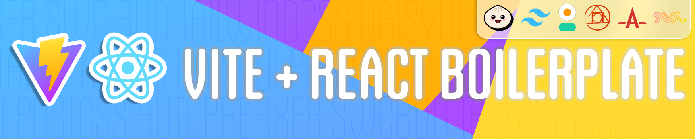

</img>

# Vite + React Boilerplate


- [Description](#description)
- [Features](#features)
- [Installation](#installation)
- [License](#license)
- [Acknowledgements](#acknowledgements)
- [Author](#author)

Welcome to the repository for the Vite and React Boilerplate! ⚡ ⚛️

This starter kit offers a foundation for your React projects, featuring TailwindCSS, DaisyUI, PostCSS, Autoprefixer, and SWC for JavaScript optimization

## Features

✨ Experience the speed and efficiency of Vite v5.2.8 in your development environment.

✨ Craft intuitive user interfaces with React v18.2.0.

✨ Accelerate your UI development with TailwindCSS.

✨ Extend TailwindCSS capabilities with DaisyUI's additional components.

✨ Employ PostCSS and Autoprefixer for seamless CSS processing.

✨ Optimize your JavaScript with SWC.

✨ Streamline build and development tasks with Bun.

## Description

Kickstart your React projects with blazing-fast development speeds using the Vite + React Boilerplate. This comprehensive starter kit provides a robust foundation for building modern web applications, leveraging the power of Vite v5.2.8, React v18.2.0, and TailwindCSS.

Experience seamless UI development with TailwindCSS, enriched by DaisyUI's additional components for crafting intuitive user interfaces. PostCSS and Autoprefixer ensure effortless CSS processing, while SWC optimizes your JavaScript for peak performance.

Streamline your build and development tasks with Bun, simplifying the process from setup to deployment. Whether you're a seasoned developer or just starting, this boilerplate empowers you to create dynamic, responsive web applications with efficiency and ease.

## Installation

Use these instructions to clone the repository and begin working with this boilerplate:

1. **Clone the Repository**

   ```zsh
   git clone https://github.com/blowe1987/Vite-React-Boilerplate.git
   cd your-repo-name
   ```

2. **Install the Dependencies**

   ```zsh
    bun i
   ```

3. **Start the Development Server**

   ```zsh
   bun dev
   ```

4. **Build for Production**

   ```zsh
    bun build
   ```

## License

This project is licensed under the MIT License. See the [LICENSE](LICENSE) file for more information.

## Acknowledgements

- [Vite](https://vitejs.dev/)
- [React](https://reactjs.org/)
- [Tailwind CSS](https://tailwindcss.com/)
- [DaisyUI](https://daisyui.com/)
- [PostCSS](https://postcss.org/)
- [Autoprefixer](https://autoprefixer.github.io/)
- [SWC](https://swc.rs/)
- [Bun](https://bun.sh/)

## Author

- [Berian Lowe](https://github.com/blowe1987)
